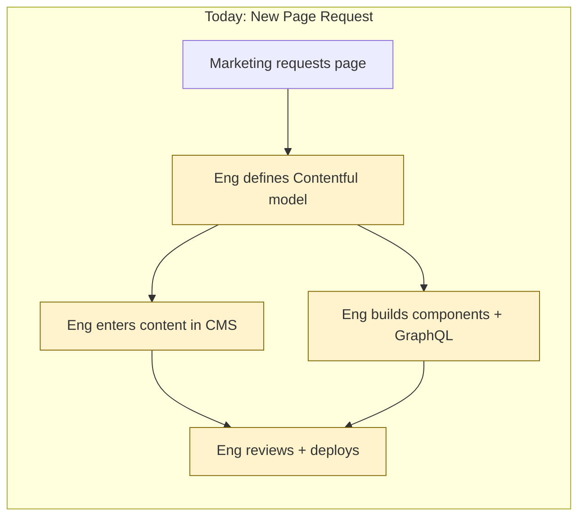
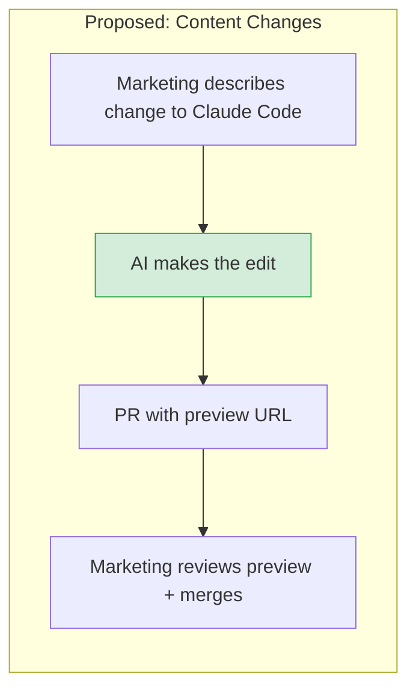
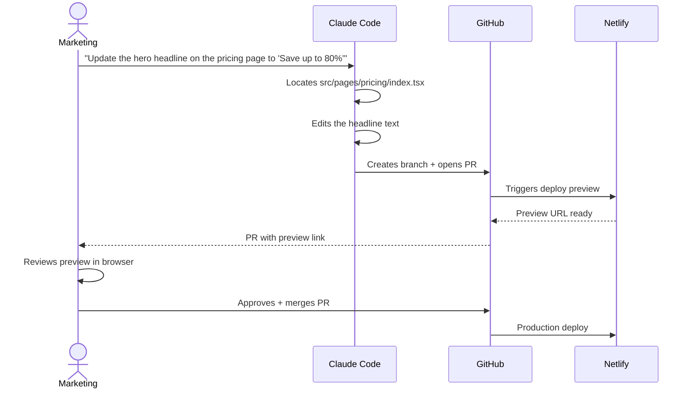
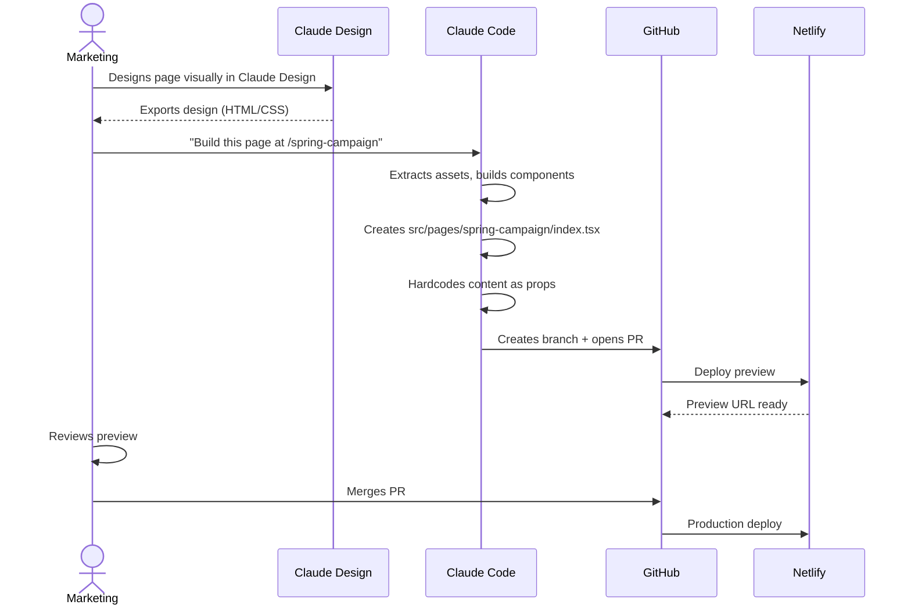
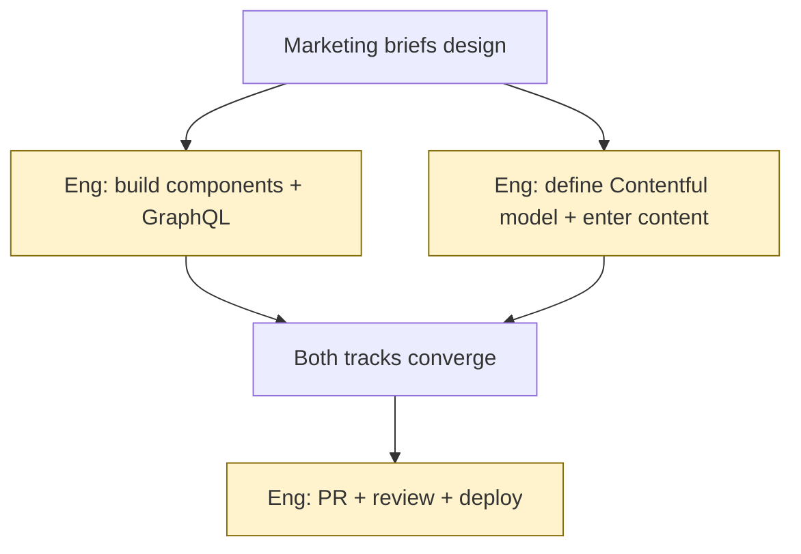
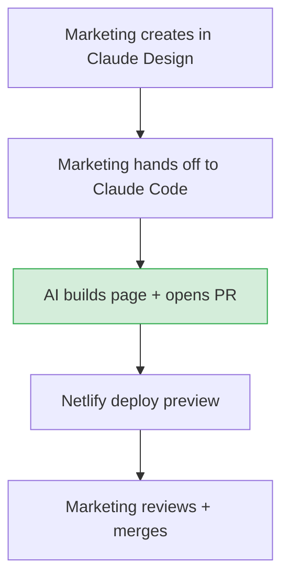
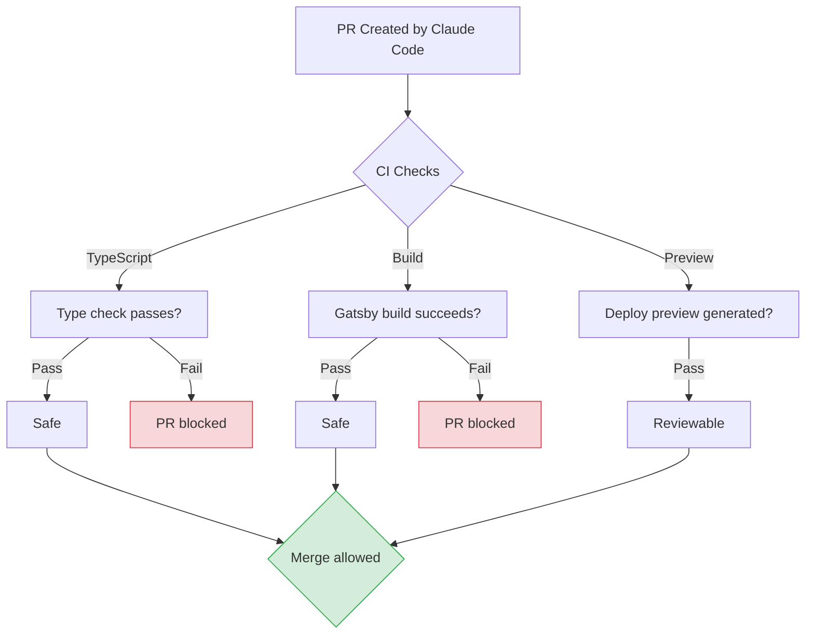
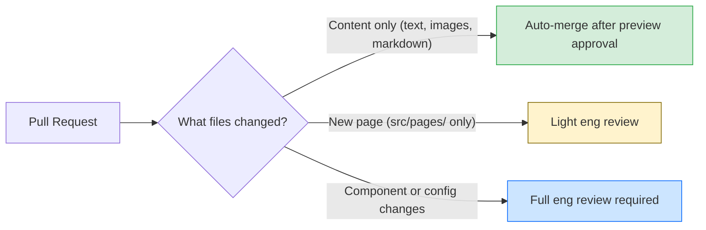
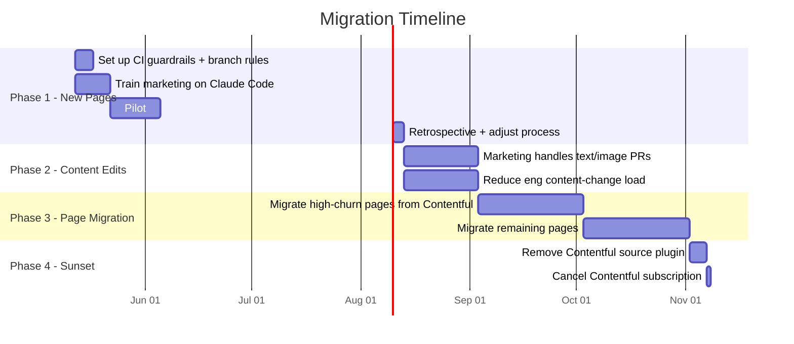
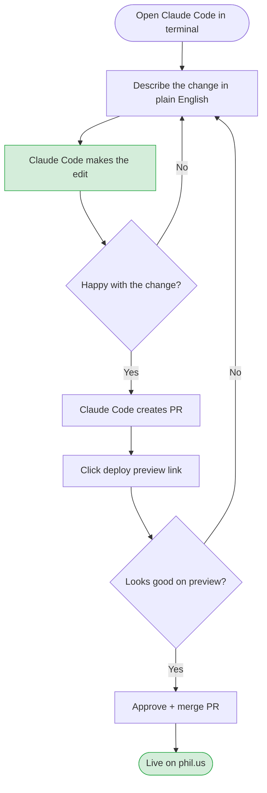

# Proposal: Remove Contentful, Adopt AI-Powered Content Workflow

**Author:** Grace Punzalan
**Date:** May 2026
**Status:** Draft
**Audience:** Marketing, Engineering, Leadership

---

## The Problem

Our current content pipeline requires engineering involvement at every stage, even for routine content changes. Despite using Contentful as a "no-code" CMS, the reality is:

1. **Engineering owns the entire Contentful pipeline** — for new pages, eng defines the content model, enters the content, builds the components, and wires up GraphQL queries. Marketing requests the page but eng does all the work.
2. **Design-to-CMS mapping is manual** — translating a static design into Contentful's data model is time-consuming and error-prone, and only eng can do it.
3. **Content changes trigger eng work** — adding a new section type, changing a layout, or restructuring a page requires code changes to `Section.tsx`, GraphQL queries, templates, and the template factory, plus corresponding Contentful model updates.
4. **The CMS adds complexity without removing eng dependency** — Contentful was meant to let marketing self-serve, but in practice eng handles both the code and the CMS setup.

**Result:** Marketing is blocked by engineering for content updates. Engineering spends time on CMS plumbing instead of product work. A "simple" landing page takes 1-2 weeks instead of 1-2 days.

---

## The Proposal

Remove Contentful. Marketing uses **Claude Code** (AI coding assistant) to make content changes directly in the site repository and raises pull requests for review.

**Claude Code replaces Contentful as the content editing interface.** Instead of clicking through a CMS dashboard, marketing describes what they want in natural language, Claude Code makes the changes, and a PR with a live preview is created for review.

---

## How It Works

### Content Update Flow

### New Page Flow

---

## What Changes

### Before vs. After

**BEFORE** — Eng handles both code and Contentful setup

**AFTER** — Marketing self-serves, eng only reviews structural changes

| | Before (Contentful) | After (Claude Code) |
|---|---|---|
| **Content editing interface** | Contentful dashboard | Natural language via Claude Code |
| **Who defines data structure** | Engineering (manual) | AI (automatic from design) |
| **Design-to-code mapping** | Manual by eng | Automated by AI |
| **Content source of truth** | Contentful API (external) | Git repository (owned) |
| **Version control** | Contentful's built-in versioning | Git history (full audit trail) |
| **Rollback** | Contentful entry restore | `git revert` |
| **Preview** | Contentful preview API + rebuild | Netlify deploy preview (already exists) |
| **Time to publish a text change** | Hours (eng involvement) | Minutes (self-serve) |
| **Time to launch a new page** | 1-2 weeks | 1-2 days |
| **Eng involvement for content** | Every change | Only structural/component changes |
| **Monthly cost** | Contentful subscription + eng time | Claude Code subscription |

---

## Guardrails: Keeping It Safe

Marketing editing code sounds risky. Here's how we prevent problems:

### Automated Safety Net

### Review Rules by Change Type

| Change Type | Example | Review Required |
|---|---|---|
| Text/image update | Change a headline, swap a photo | Marketing self-approves after preview |
| New static page | Launch a campaign landing page | Light eng review (component reuse check) |
| New component | Add a new section type or layout | Full eng review |
| Config/build change | Modify gatsby-config, netlify.toml | Full eng review |

### Branch Protection

- `main` branch is protected — no direct pushes
- All changes go through PRs with deploy previews
- CI must pass (TypeScript, build) before merge is allowed
- Marketing merges content PRs; eng merges code PRs

---

## Migration Strategy

This is not a big-bang migration. We run both systems in parallel and migrate incrementally.

### Phase 1: New Pages Go Static (Weeks 1-4)

**Phase 1** — All *new* pages are built as static pages in `src/pages/` using Claude Code. Existing Contentful pages are untouched.

**Phase 2** — Marketing starts making text/image edits to existing pages via Claude Code PRs. Eng reviews only structural changes.

**Phase 3** — Migrate existing Contentful-driven pages to static pages. Start with high-churn pages (pages that get updated most frequently). AI handles the conversion — reads the current Contentful-rendered output and creates equivalent static pages.

**Phase 4** — Once all pages are migrated, remove `gatsby-source-contentful`, related GraphQL queries, strategy files, and template factory. Cancel Contentful subscription.

---

## What Marketing Needs to Learn

Claude Code is a terminal-based AI assistant. Marketing doesn't need to learn to code — they need to learn a workflow:

### The Daily Workflow

### Example Prompts Marketing Would Use

| Task | What You Tell Claude Code |
|---|---|
| Update headline | "Change the hero headline on /pricing to 'Save up to 80% on prescriptions'" |
| Swap an image | "Replace the hero image on /about with this new photo" (attach file) |
| Add a testimonial | "Add a new testimonial card to /customers from Dr. Smith saying '...'" |
| Launch a page | "Build a new landing page at /spring-sale based on this design" (attach export) |
| Update SEO | "Update the meta description on /enterprise to '...'" |
| Fix a typo | "There's a typo on /blog/post-name — change 'recieve' to 'receive'" |

### Training Plan

| Session | Duration | Content |
|---|---|---|
| Intro to Claude Code | 1 hour | Install, navigate, basic prompts |
| Content editing workshop | 1 hour | Edit text, images, SEO metadata with live practice |
| New page creation | 1 hour | Claude Design export to Claude Code build |
| PR workflow | 30 min | Preview URLs, approving, merging |

---

## Risks and Mitigations

| Risk | Likelihood | Impact | Mitigation |
|---|---|---|---|
| Marketing breaks the build | Medium | Low | CI blocks broken PRs from merging. TypeScript + build checks catch errors before deploy. |
| AI generates incorrect code | Low | Low | Deploy preview lets marketing visually verify before merge. Eng reviews structural changes. |
| Marketing is uncomfortable with terminal workflow | Medium | Medium | Training sessions + reference prompts. Claude Code's natural language interface is approachable. Evaluate web-based Claude Code as alternative. |
| Loss of Contentful's content scheduling | Low | Medium | Implement GitHub Actions for scheduled merges, or use Netlify's scheduled deploys. |
| Rollback is harder without CMS | Low | Low | `git revert` is faster and more reliable than Contentful entry restore. |
| AI hallucinations in content | Low | Medium | Marketing reviews all preview URLs before merge — same review they'd do in Contentful. |

---

## Cost Comparison

| Item | Current (Contentful) | Proposed (Claude Code) |
|---|---|---|
| CMS subscription | Contentful Team/Enterprise plan | $0 (removed) |
| AI tooling | - | Claude Code Pro/Team seats for marketing |
| Eng time on CMS plumbing | ~15-20% of content-related eng work | ~5% (structural reviews only) |
| Time to publish content change | Hours to days | Minutes |
| Time to launch new page | 1-2 weeks | 1-2 days |

---

## FAQ

**Q: What if Claude Code is down?**
A: Content lives in Git. Anyone can edit files directly and raise a PR. Claude Code speeds up the workflow but isn't a single point of failure.

**Q: Can we still schedule content?**
A: Yes. Use GitHub's scheduled merge actions or Netlify's scheduled deploys to publish PRs at specific times.

**Q: What about non-text content like forms?**
A: HubSpot forms are already embedded via component props. Claude Code can add/update form IDs the same way engineering does today.

**Q: Do we lose content preview?**
A: No — Netlify deploy previews give you a full, live preview of every change before it goes to production. This is actually better than Contentful's preview mode, which requires a full rebuild.

**Q: What happens to existing blog posts and resources?**
A: They stay as-is during migration. We migrate them incrementally in Phase 3. No content is lost — Contentful data is converted to static pages.

**Q: Does marketing need to learn Git?**
A: No. Claude Code handles Git operations (branching, committing, pushing, PR creation). Marketing only needs to review preview URLs and click "merge" on GitHub.
