# Proposal: Remove Contentful, Adopt AI-Powered Content Workflow

**Author:** Grace Punzalan
**Date:** May 2026
**Status:** Draft
**Audience:** Marketing, Engineering, Leadership

---

## What Is Contentful and How Do We Use It Today?

**Contentful** is a headless content management system (CMS). Unlike traditional CMS platforms like WordPress where content and presentation are bundled together, Contentful only manages content — it stores text, images, and structured data, then delivers it via API to our website at build time.

### How phil.us works today

Our marketing site ([phil.us](https://phil.us)) is built with Gatsby, a static site generator. When we deploy, Gatsby pulls all content from Contentful's API, combines it with our code (components, templates, styles), and generates static HTML pages that are hosted on Netlify.

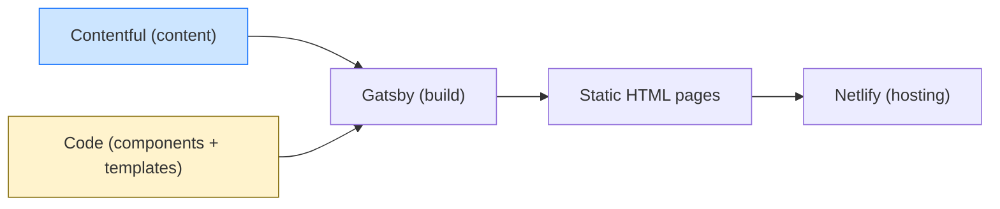

### What lives in Contentful

| Content Type | What It Stores | Examples | Can this live in code instead? |
|---|---|---|---|
| **Pages** | Top-level page structure — title, slug, SEO metadata, and a list of sections | /about, /pricing, /enterprise | Yes — static page files in `src/pages/` |
| **Sections** | Content blocks within a page — headlines, body text, images, forms | Hero sections, feature grids, FAQ accordions | Yes — props passed to reusable React components |
| **Resources** | Blog posts, articles, testimonials | Insight articles, customer stories | Yes — markdown or TypeScript content files |
| **Case Studies** | Structured case study content — metrics, quotes, takeaways | Customer success stories | Yes — structured data in content files |
| **Downloadable Resources** | Gated content with HubSpot forms | Whitepapers, guides, reports | Yes — static pages with form embed IDs |
| **Events** | Event registration pages with speaker info and dates | Webinars, conferences | Yes — static pages with event data as props |

There are **15+ content models** in Contentful with **30+ section layout types**, each requiring its own code to render. **All of this is just structured data (text, image references, metadata) — none of it requires a CMS. Everything Contentful stores can live directly in the codebase as static files.**

### Why we originally chose Contentful

The intent was to let marketing update content without engineering. In practice, Contentful requires eng to:

1. **Define the content model** — create the data structure (fields, types, validations) for every new page type or section
2. **Enter the content** — for new pages, eng populates Contentful because the model and content are created together
3. **Write the rendering code** — build the React components, GraphQL queries, and template wiring that turns Contentful data into HTML
4. **Maintain the mapping** — keep the code in sync with the Contentful model as it evolves

The CMS layer adds complexity without removing the engineering dependency it was meant to eliminate.

---

## The Problem

Our current content pipeline requires engineering involvement at every stage, even for routine content changes. Despite using Contentful as a "no-code" CMS, the reality is:

1. **Engineering owns the entire Contentful pipeline** — for new pages, eng defines the content model, enters the content, builds the components, and wires up GraphQL queries. Marketing requests the page but eng does all the work.
2. **Design-to-CMS mapping is manual** — translating a static design into Contentful's data model is time-consuming and error-prone, and only eng can do it.
3. **Content changes trigger eng work** — adding a new section type, changing a layout, or restructuring a page requires code changes to `Section.tsx`, GraphQL queries, templates, and the template factory, plus corresponding Contentful model updates.
4. **The CMS adds complexity without removing eng dependency** — Contentful was meant to let marketing self-serve, but in practice eng handles both the code and the CMS setup.

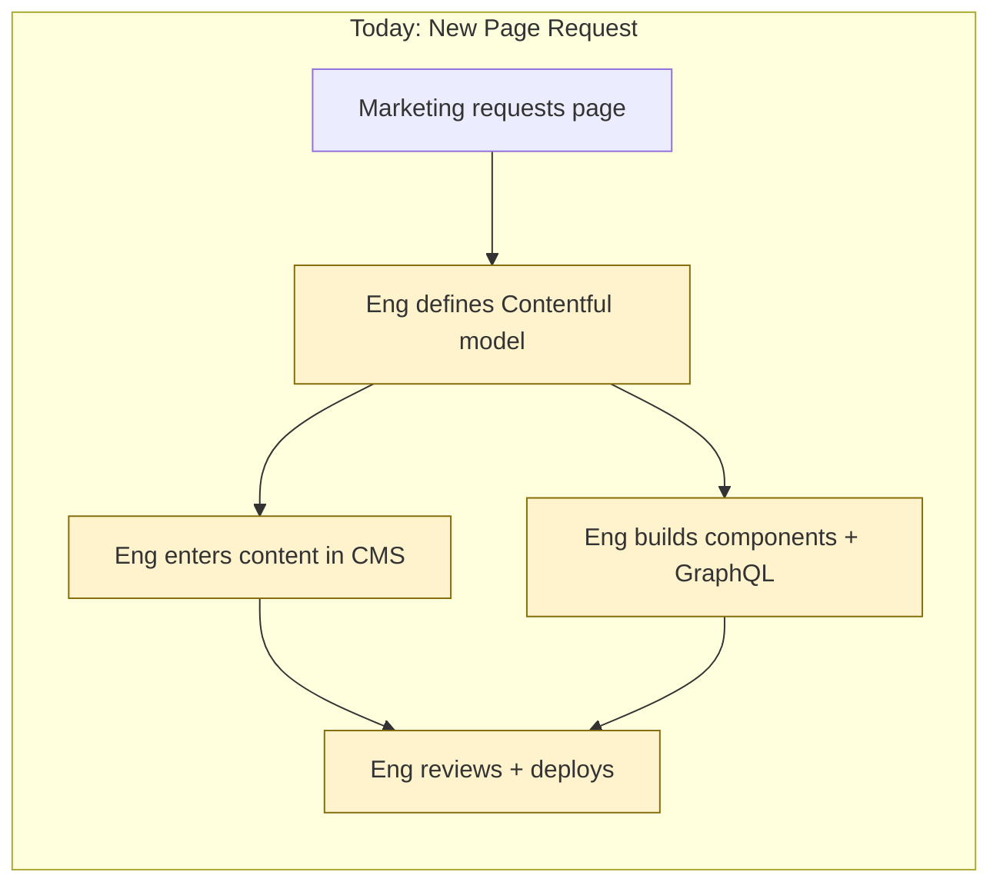

**Result:** Marketing is blocked by engineering for content updates. Engineering spends time on CMS plumbing instead of product work. A "simple" landing page takes 1-2 weeks instead of 1-2 days.

---

## The Proposal

Remove Contentful. Marketing uses **Claude Design** to create and iterate on page designs, and **Claude Code Desktop** to implement changes in the site repository and raise pull requests for review.

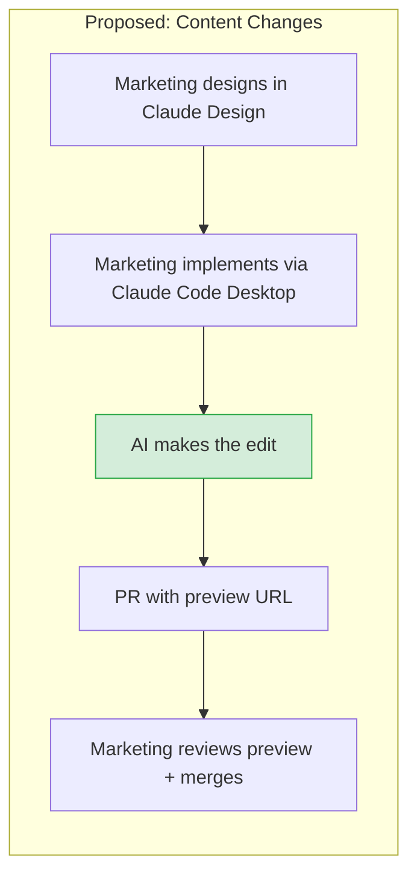

**Claude Design + Claude Code Desktop replace Contentful as the content workflow.** Instead of clicking through a CMS dashboard, marketing designs visually in Claude Design, then uses Claude Code Desktop to implement the changes — describing what they want in natural language. A PR with a live preview is created for review.

---

## How It Works

### Content Update Flow

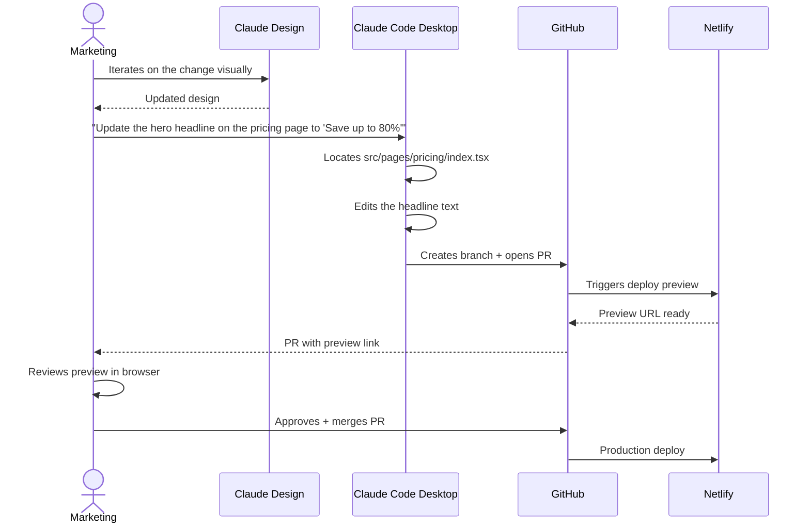

### New Page Flow

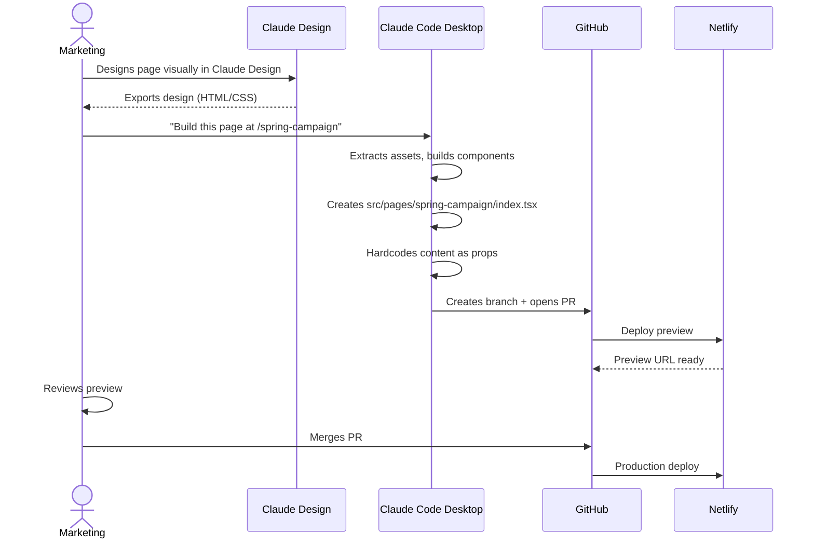

---

## What Changes

### Before vs. After

**BEFORE** — Eng handles both code and Contentful setup

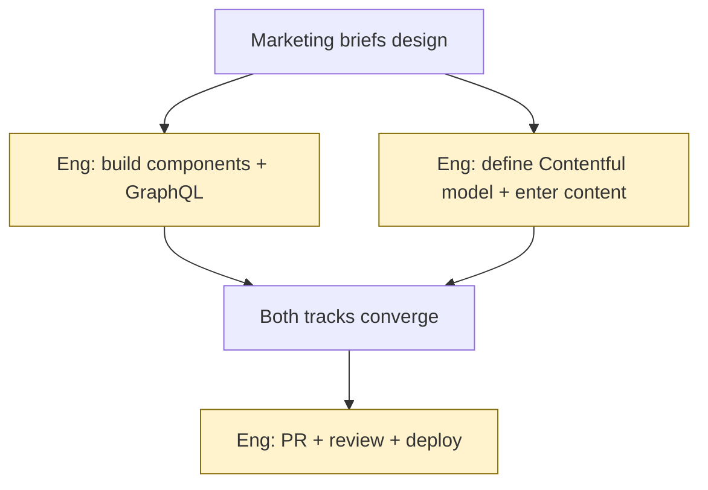

**AFTER** — Marketing self-serves, eng only reviews structural changes

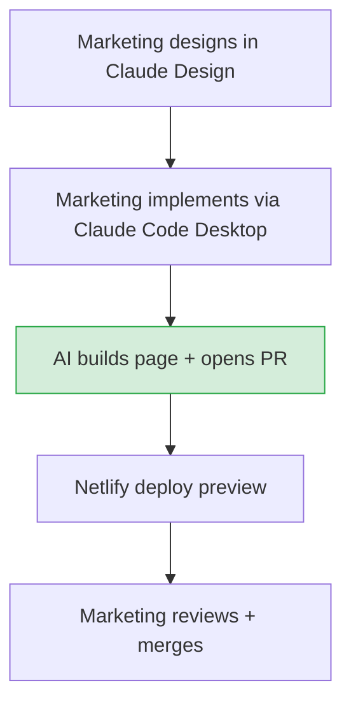

| | Before (Contentful) | After (Claude Design + Claude Code Desktop) |
|---|---|---|
| **Design workflow** | Static mockups handed to eng | Marketing iterates in Claude Design |
| **Content editing interface** | Contentful dashboard | Natural language via Claude Code Desktop |
| **Who defines data structure** | Engineering (manual) | AI (automatic from design) |
| **Design-to-code mapping** | Manual by eng | Automated by AI |
| **Content source of truth** | Contentful API (external) | Git repository (owned) |
| **Version control** | Contentful's built-in versioning | Git history (full audit trail) |
| **Rollback** | Contentful entry restore | `git revert` |
| **Preview** | Contentful preview API + rebuild | Netlify deploy preview (already exists) |
| **Time to publish a text change** | Hours (eng involvement) | Minutes (self-serve) |
| **Time to launch a new page** | 1-2 weeks | 1-2 days |
| **Eng involvement for content** | Every change | Only structural/component changes |
| **Monthly cost** | Contentful subscription + eng time | Claude Design + Claude Code Desktop subscriptions |

---

## Guardrails: Keeping It Safe

Marketing editing code sounds risky. Here's how we prevent problems:

### Automated Safety Net

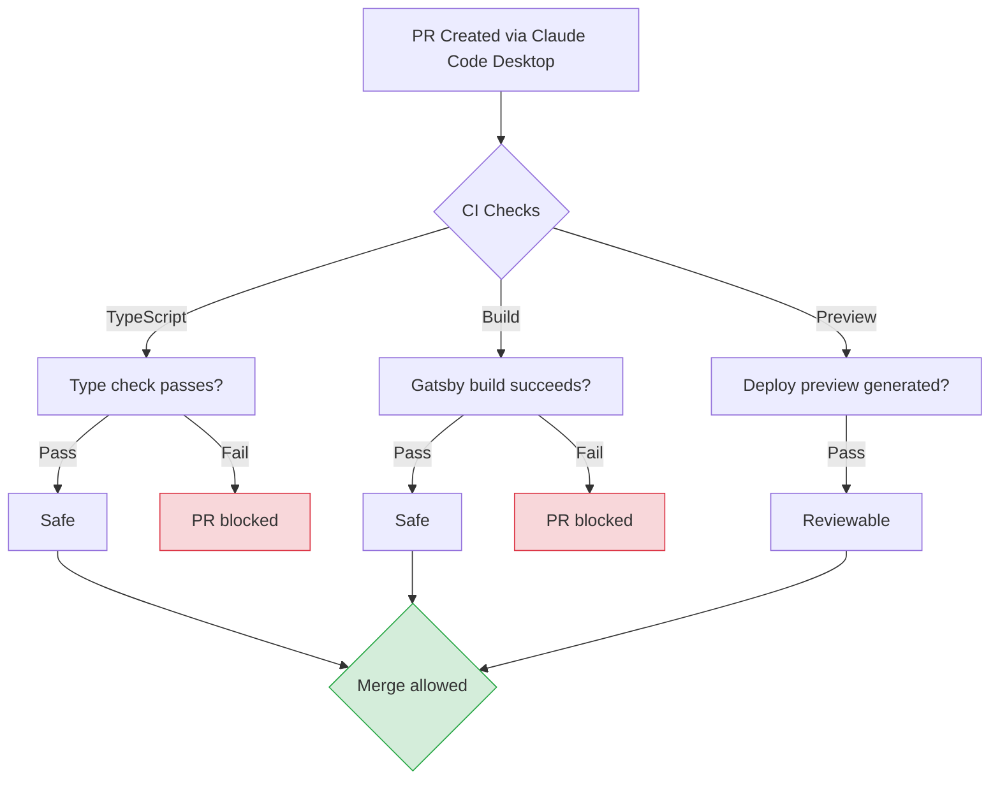

### Review Rules by Change Type

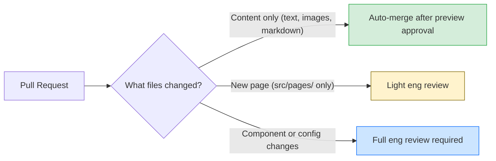

| Change Type | Example | Review Required |
|---|---|---|
| Text/image update | Change a headline, swap a photo | Marketing self-approves after preview |
| New static page | Launch a campaign landing page | Light eng review (component reuse check) |
| New component | Add a new section type or layout | Full eng review |
| Config/build change | Modify gatsby-config, netlify.toml | Full eng review |

### Branch Protection

- `main` branch is protected — no direct pushes
- All changes go through PRs with deploy previews
- CI must pass (TypeScript, build) before merge is allowed
- Marketing merges content PRs; eng merges code PRs

---

## Migration Strategy

This is not a big-bang migration. We run both systems in parallel and migrate incrementally.

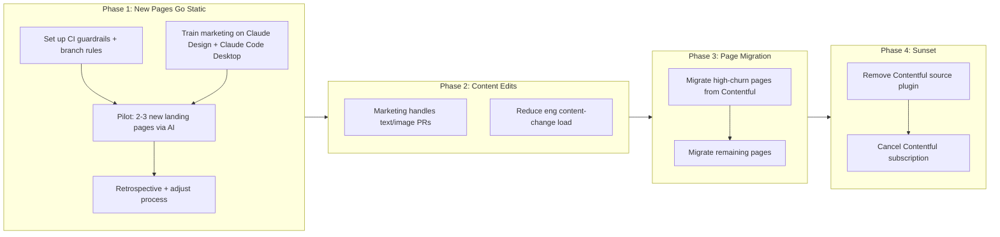

**Phase 1** — All *new* pages are designed in Claude Design and built as static pages in `src/pages/` via Claude Code Desktop. Existing Contentful pages are untouched.

**Phase 2** — Marketing starts making text/image edits to existing pages via Claude Code Desktop PRs. Eng reviews only structural changes.

**Phase 3** — Migrate existing Contentful-driven pages to static pages. Start with high-churn pages (pages that get updated most frequently). AI handles the conversion — reads the current Contentful-rendered output and creates equivalent static pages.

**Phase 4** — Once all pages are migrated, remove `gatsby-source-contentful`, related GraphQL queries, strategy files, and template factory. Cancel Contentful subscription.

---

## Engineering Implementation

What eng needs to build to enable this workflow.

### Overview

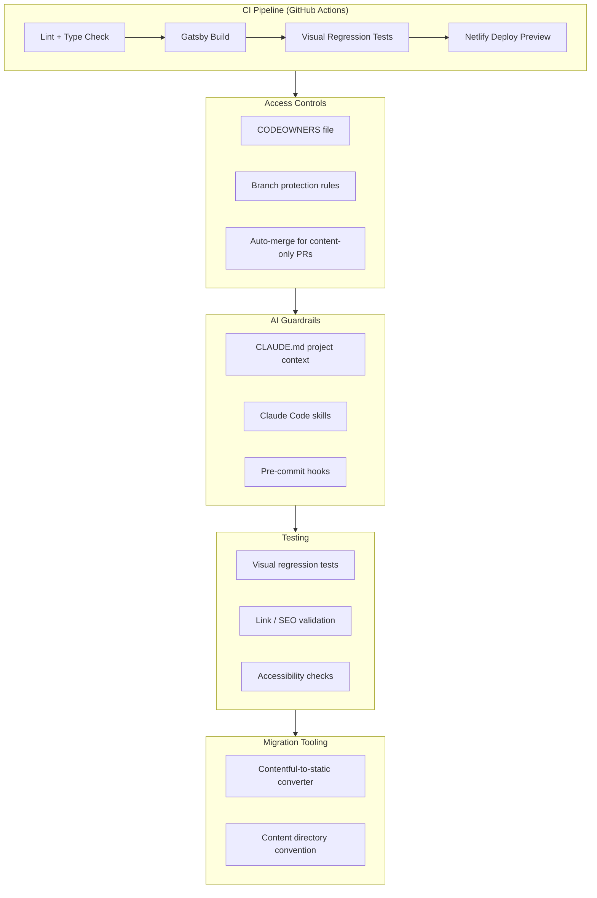

### 1. CI Pipeline (GitHub Actions)

No CI exists today — Netlify handles builds but there are no PR checks. We need a GitHub Actions workflow that blocks broken PRs from merging.

| Check | Tool | Purpose |
|---|---|---|
| TypeScript | `tsc --noEmit` | Catch type errors before build |
| Lint | `eslint .` | Enforce code style |
| Build | `gatsby build` | Verify the site actually builds |
| Visual regression | Percy or Playwright screenshots | Catch unintended visual changes |
| Link validation | `broken-link-checker` or custom | Catch dead internal links |
| Accessibility | `axe-core` or `pa11y` | Catch a11y regressions |

### 2. Testing Strategy

Currently the repo only has utility unit tests (`src/__tests__/utils/`). We need tests that give marketing confidence their changes didn't break anything.

**Visual regression tests** — the highest-value addition. Capture baseline screenshots of every page, then compare on each PR. Marketing can see exactly what changed visually.

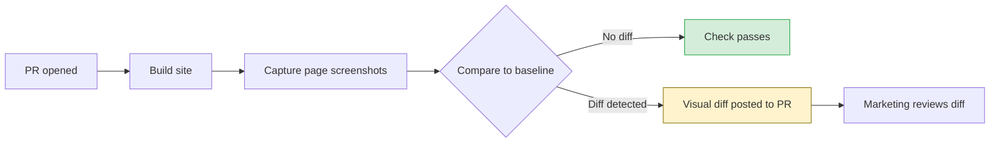

| Test Type | What It Catches | Tool Options |
|---|---|---|
| Visual regression | Layout breaks, missing images, font changes | Playwright screenshots, Percy, Chromatic |
| Link validation | Broken internal links, dead anchors | Custom script or `broken-link-checker` |
| SEO validation | Missing meta titles/descriptions, broken OG tags | Custom script checking `<Head>` output |
| Accessibility | Color contrast, missing alt text, ARIA issues | `axe-core`, `pa11y-ci` |
| Build smoke test | Import errors, missing assets, TypeScript errors | `gatsby build` (already exists as npm script) |

### 3. Branch Protection + CODEOWNERS

**Branch protection rules** on `main`:
- Require PR reviews before merge
- Require CI status checks to pass
- No direct pushes

**CODEOWNERS** file to route reviews by change type:

```
# Eng reviews anything outside content directories
*                           @phil-inc/engineering

# Marketing can self-approve content-only changes
src/pages/**/content.ts     @phil-inc/marketing
src/pages/**/assets/        @phil-inc/marketing
static/                     @phil-inc/marketing
```

**Auto-merge** — GitHub Action that auto-approves PRs when:
- Only content files changed (text, images, static assets)
- All CI checks pass
- Deploy preview is generated

### 4. CLAUDE.md Project Context

A `CLAUDE.md` at repo root gives Claude Code Desktop the context it needs to make correct edits. This is the single most important file for the implementation workflow — it teaches the AI how the project works.

Contents:
- Project architecture and conventions (already documented in `CONTEXT.md` — merge in)
- Component reuse guidelines (use existing components before creating new ones)
- Styling rules (Mantine theme, CSS Modules, responsive breakpoints)
- File naming conventions
- What files marketing should and shouldn't touch
- PR creation instructions

### 5. Claude Code Skills

Expand the existing `skills/` directory with marketing-facing skills:

| Skill | Purpose |
|---|---|
| `create-landing-from-design` | Already exists — converts Claude Design exports to static pages |
| `edit-page-content` | New — guides AI through safe content edits (text, images, SEO) |
| `add-blog-post` | New — creates a new blog post from a brief |
| `update-seo` | New — updates meta tags, OG images, descriptions |

### 6. Content Directory Convention

Establish a clear separation between content and code so CODEOWNERS and auto-merge rules work:

```
src/pages/spring-campaign/
├── index.tsx           # Page component (imports content)
├── content.ts          # All text, headlines, CTAs (marketing edits this)
├── assets/             # Images, icons (marketing edits this)
└── springCampaign.module.css  # Styles (eng reviews)
```

Marketing edits `content.ts` and `assets/`. Structural changes to `index.tsx` or styles require eng review.

### 7. Migration Script

A Claude Code skill or script that converts a Contentful-driven page to a static page:

1. Query the Contentful API for the page's current data
2. Generate a static `src/pages/{slug}/index.tsx` with the same content hardcoded
3. Generate a `content.ts` file with extractable text
4. Copy referenced assets (images) to the page's `assets/` directory
5. Verify the output matches the original visually (screenshot comparison)

### 8. Pre-commit Hooks

Extend the existing Husky setup with hooks that catch problems before they reach CI:

- TypeScript type check
- Lint staged files
- Validate image sizes (prevent marketing from committing 10MB PNGs)
- Check for accidental secret/credential commits

### Build Priority

```mermaid
flowchart LR
    subgraph p0["P0 — Before pilot"]
        direction TB
        P0A["GitHub Actions CI pipeline"]
        P0B["Branch protection rules"]
        P0C["CLAUDE.md project context"]
    end

    subgraph p1["P1 — During pilot"]
        direction TB
        P1A["Visual regression tests"]
        P1B["CODEOWNERS + auto-merge"]
        P1C["Content directory convention"]
    end

    subgraph p2["P2 — Before Phase 3"]
        direction TB
        P2A["Migration script"]
        P2B["Additional Claude Code skills"]
        P2C["SEO + link + a11y checks"]
    end

    p0 --> p1 --> p2
```

| Priority | Item | Effort |
|---|---|---|
| **P0** | GitHub Actions CI (lint, typecheck, build) | ~1 day |
| **P0** | Branch protection rules on `main` | ~1 hour |
| **P0** | CLAUDE.md project context | ~1 day |
| **P1** | Visual regression tests (Playwright screenshots) | ~2-3 days |
| **P1** | CODEOWNERS + auto-merge action | ~half day |
| **P1** | Content directory convention + docs | ~half day |
| **P2** | Contentful-to-static migration script | ~2-3 days |
| **P2** | Additional Claude Code skills | ~1-2 days |
| **P2** | SEO, link, and accessibility CI checks | ~1-2 days |

---

## SEO and GEO: What Improves, What Stays, What We Should Add

### What we have today

The site already has baseline SEO in place:

| SEO Feature | Current State | Source |
|---|---|---|
| Meta titles + descriptions | Per-page via Contentful `title` and `description` fields | `Head.tsx` |
| Open Graph tags | `og:title`, `og:description`, `og:image`, `og:url` | `Head.tsx` |
| Twitter cards | `summary_large_image` with title, description, image | `Head.tsx` |
| Canonical URLs | Per-page `<link rel="canonical">` | `Head.tsx` |
| JSON-LD: WebPage | Schema.org WebPage on every page | `Head.tsx` |
| JSON-LD: Organization | Schema.org Organization on homepage | `Head.tsx` |
| JSON-LD: Article | Schema.org Article on blog posts and case studies | `blog.tsx`, `case-study.tsx` |
| Sitemap | Auto-generated via `gatsby-plugin-sitemap` | `gatsby-config.ts` |
| Robots.txt | Auto-generated via `gatsby-plugin-robots-txt` | `gatsby-config.ts` |
| Noindex support | Per-page `noindex` flag from Contentful | `Head.tsx` |

### Nothing is lost by removing Contentful

All SEO metadata currently pulled from Contentful fields moves into the page files directly. The rendered HTML output is identical — search engines and AI models see no difference.

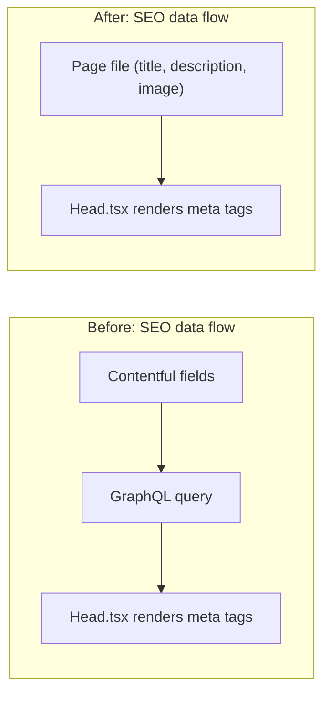

Sitemap generation, robots.txt, JSON-LD schemas, and OG tags all continue to work exactly as they do today — they're generated by Gatsby plugins and React components, not by Contentful.

### What we should add: GEO optimization

GEO (Generative Engine Optimization) makes our content more likely to be cited by AI-powered search engines like ChatGPT, Perplexity, and Google AI Overviews. Removing Contentful actually makes these improvements easier because we control the HTML directly.

**Recommended additions:**

| Enhancement | What It Does | Why It Matters for GEO |
|---|---|---|
| **FAQ schema (JSON-LD)** | Add `FAQPage` structured data to pages with FAQ sections | AI search engines pull directly from FAQ schema to answer questions |
| **HowTo schema** | Add `HowTo` structured data to process/workflow pages | Makes step-by-step content citable by AI |
| **Product schema** | Add `Product` structured data to service pages | Helps AI search engines understand and recommend our offerings |
| **Semantic HTML** | Use `<article>`, `<section>`, `<aside>`, proper heading hierarchy | AI models parse semantic HTML more accurately than generic `<div>` soup |
| **Structured content blocks** | Clear, factual statements with statistics and citations | AI models favor well-sourced, direct answers over marketing copy |
| **Internal linking** | Consistent cross-linking between related pages | Builds topical authority that AI models use to assess expertise |

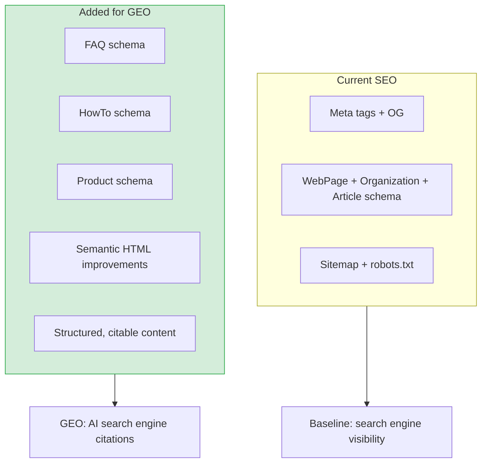

### Why this is easier without Contentful

With Contentful, adding new schema types means updating the content model, adding fields, writing GraphQL fragments, and building rendering logic — the same eng bottleneck we're trying to remove.

With static pages, marketing adds structured content via Claude Code Desktop, and schema markup can be generated automatically from the page structure. A Claude Code skill can validate and enrich schema on every PR.

---

## What Marketing Needs to Learn

Marketing uses two tools: **Claude Design** for visual creation and iteration, and **Claude Code Desktop** for implementing changes in the codebase. Neither requires coding knowledge — both use natural language interfaces. Marketing just needs to learn the workflow:

### The Daily Workflow

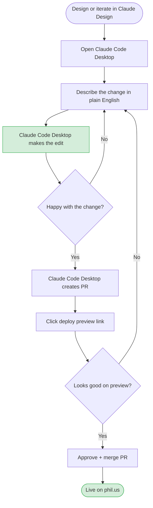

### Example Prompts Marketing Would Use

| Task | What You Tell Claude Code Desktop |
|---|---|
| Update headline | "Change the hero headline on /pricing to 'Save up to 80% on prescriptions'" |
| Swap an image | "Replace the hero image on /about with this new photo" (attach file) |
| Add a testimonial | "Add a new testimonial card to /customers from Dr. Smith saying '...'" |
| Launch a page | "Build a new landing page at /spring-sale based on this design" (attach export) |
| Update SEO | "Update the meta description on /enterprise to '...'" |
| Fix a typo | "There's a typo on /blog/post-name — change 'recieve' to 'receive'" |

### Training Plan

| Session | Duration | Content |
|---|---|---|
| Intro to Claude Design | 1 hour | Visual design creation, iteration, exporting |
| Intro to Claude Code Desktop | 1 hour | Install app, open project, basic prompts |
| Content editing workshop | 1 hour | Edit text, images, SEO metadata with live practice |
| New page creation | 1 hour | End-to-end: Claude Design to Claude Code Desktop to deploy |
| PR workflow | 30 min | Preview URLs, approving, merging |

---

## Risks and Mitigations

| Risk | Likelihood | Impact | Mitigation |
|---|---|---|---|
| Marketing breaks the build | Medium | Low | CI blocks broken PRs from merging. TypeScript + build checks catch errors before deploy. |
| AI generates incorrect code | Low | Low | Deploy preview lets marketing visually verify before merge. Eng reviews structural changes. |
| Marketing finds the tools unfamiliar | Medium | Medium | Both Claude Design and Claude Code Desktop have chat-like interfaces — no terminal or coding needed. Training sessions + reference prompts lower the learning curve. |
| Loss of Contentful's content scheduling | Low | Medium | Implement GitHub Actions for scheduled merges, or use Netlify's scheduled deploys. |
| Rollback is harder without CMS | Low | Low | `git revert` is faster and more reliable than Contentful entry restore. |
| AI hallucinations in content | Low | Medium | Marketing reviews all preview URLs before merge — same review they'd do in Contentful. |

---

## Cost Comparison

| Item | Current (Contentful) | Proposed (Claude Design + Claude Code Desktop) |
|---|---|---|
| CMS subscription | Contentful Team/Enterprise plan | $0 (removed) |
| AI tooling | - | Claude Design + Claude Code Desktop seats for marketing |
| Eng time on CMS plumbing | ~15-20% of content-related eng work | ~5% (structural reviews only) |
| Time to publish content change | Hours to days | Minutes |
| Time to launch new page | 1-2 weeks | 1-2 days |

---

## FAQ

**Q: What if Claude Design or Claude Code Desktop is down?**
A: Content lives in Git. Anyone can edit files directly and raise a PR. The AI tools speed up the workflow but aren't a single point of failure.

**Q: Can we still schedule content?**
A: Yes. Use GitHub's scheduled merge actions or Netlify's scheduled deploys to publish PRs at specific times.

**Q: What about non-text content like forms?**
A: HubSpot forms are already embedded via component props. Claude Code Desktop can add/update form IDs the same way engineering does today.

**Q: Do we lose content preview?**
A: No — Netlify deploy previews give you a full, live preview of every change before it goes to production. This is actually better than Contentful's preview mode, which requires a full rebuild.

**Q: What happens to existing blog posts and resources?**
A: They stay as-is during migration. We migrate them incrementally in Phase 3. No content is lost — Contentful data is converted to static pages.

**Q: Does marketing need to learn Git or the terminal?**
A: No. Claude Design is a visual tool in the browser. Claude Code Desktop is a native app with a familiar chat interface. Both use natural language — no terminal or Git knowledge needed. Claude Code Desktop handles all Git operations (branching, committing, pushing, PR creation) behind the scenes. Marketing only needs to describe the change, review the preview URL, and click "merge" on GitHub.
